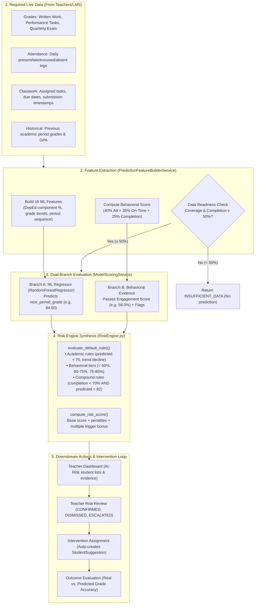

# Entervene ML System Documentation

> How the prediction and at-risk detection system works, end to end.

---

## 1. What the System Does (Overview)

Entervene uses a **Machine Learning model** to predict a student's **next period grade** and then uses a **rule-based Risk Engine** to classify that student into a risk level. This helps teachers identify students who may be struggling early, so they can provide timely interventions.

```
Student academic records (grades, scores, submissions)
    ↓
Feature Builder (computes 16 ML features from records)
    ↓
Random Forest Regressor (predicts next period grade)
    ↓
Risk Engine (classifies risk level based on predicted grade + evidence)
    ↓
Result: risk_level, risk_score, causes, recommended actions
    ↓
Saved to database → shown on teacher dashboard → teacher reviews/assigns intervention
```

---

## 2. The ML Algorithm

### Model: Random Forest Regressor

| Property | Value |
|---|---|
| Algorithm | `RandomForestRegressor` (scikit-learn) |
| Type | **Regression** (predicts a number, not a category) |
| Target variable | `target_next_period_grade` (the student's grade in the next quarter) |
| Number of trees | 300 |
| Missing value strategy | Median imputation |
| Random state | 42 (for reproducibility) |

**Key point:** The model does **NOT** directly predict "at-risk" or "not at-risk." It predicts a **grade number** (e.g., 87.5), then the Risk Engine interprets whether that grade is concerning.

### Why Regression Instead of Classification?

The training dataset contains **zero below-75 grade examples** (all students passed). Without actual failing examples, a binary classifier (at-risk vs. not-at-risk) cannot learn what a failing student looks like. Instead, the system:

1. Predicts the **numeric grade** using regression
2. Uses a **rule-based Risk Engine** to interpret the predicted grade along with other evidence

This approach works because even without failing examples, the model can identify students trending toward lower grades, which the Risk Engine flags.

---

## 3. Training Data

### Data Source

The training data comes from **real E-Class Record workbooks** (DepEd electronic class records) that were extracted, anonymized, and processed into ML-ready CSV files.

### Dataset Numbers

| Item | Count |
|---|---|
| Total training rows | 1,580 |
| Total test rows | 395 |
| Unique students (train) | 448 |
| Unique students (test) | 113 |
| Student overlap between train/test | **0** (no data leakage) |
| Below-75 grade examples | **0** (all students passed) |

### How Data Was Prepared

```
E-Class Record Excel workbooks
    ↓
Extraction & anonymization (synthetic IDs, no real names/LRNs)
    ↓
Normalized CSV pack (17 CSV files: students, classes, grades, assessments, etc.)
    ↓
ML-optimized pack (feature engineering, train/test split by student)
    ↓
03_random_forest_regression_train.csv  (938 rows)
04_random_forest_regression_test.csv   (231 rows)
```

### Data Validity

- **Student identity separation**: Train and test sets are split by student (0 overlap), preventing data leakage.
- **Anonymized**: Student names and LRNs in the dataset are synthetic — they are NOT real student identities.
- **Below-75 limitation**: The dataset has no failing examples. This means:
  - The model has never seen what a failing student's data looks like
  - Classification metrics (Accuracy, AUC, Precision, Recall, F1) are **not valid** for at-risk detection
  - The model's lowest predicted grade was **83.46** (still above passing)

---

## 4. The 16 Features (Model Inputs)

These are the inputs the model uses to predict the next period grade, ranked by importance:

| Rank | Feature | Importance | Description |
|---|---|---|---|
| 1 | `source_period_grade` | 56.5% | Student's current period grade |
| 2 | `cumulative_period_grade_avg` | 18.7% | Average of all previous period grades |
| 3 | `written_work_percent` | 6.7% | Written work component percentage |
| 4 | `quarterly_assessment_percent` | 4.9% | Quarterly exam/assessment percentage |
| 5 | `performance_task_percent` | 4.0% | Performance task component percentage |
| 6 | `grade_trend_vs_previous_period` | 2.5% | Grade change from previous period |
| 7 | `period_sequence` | 2.4% | Which quarter/term (1st, 2nd, etc.) |
| 8 | `grade_level` | 1.1% | Student's year level |
| 9-14 | `subject_*` (6 one-hot flags) | ~2.8% total | Which subject (Creative Tech, ICT, Science, Math, Electronics, Values Ed) |
| 15 | `has_previous_period` | 0.4% | Whether a previous period grade exists |
| 16 | `assessment_completion_rate` | 0.05% | Fraction of assessments completed |

### How Features Are Built from Live Records

The `PredictionFeatureBuilderService` computes these features by querying the database:

- **Grade components**: Pulls `AssessmentItem` and `StudentAssessmentScore` records, groups by DepEd component (Written Work, Performance Task, Quarterly Assessment), computes percentages
- **Submissions**: Pulls `Classwork` and `StudentSubmission` records for missing/late counts
- **Grade history**: Queries `StudentPeriodGrade` for current and previous period grades, computes trend and cumulative average
- **Subject**: One-hot encodes the subject name

### Readiness Check (Before Running the Model)

Before the model runs, the system checks if there is enough data:

| Level | Condition |
|---|---|
| **INSUFFICIENT** (blocked) | Source period grade missing, OR data coverage < 50%, OR completion rate < 50% |
| **MINIMUM** | Coverage 50–69% |
| **GOOD** | Coverage 70–84% |
| **STRONG** | Coverage ≥ 85% |

If readiness is `INSUFFICIENT`, no prediction is made and the response returns `INSUFFICIENT_DATA`.

> **Note on Behavioral Evidence:** The ML Regressor uses the 16 academic/contextual features above. Live behavioral evidence (`behavioral_engagement_score`, `risk_adjusted_attendance_rate`, `missing_activity_count`, `late_submission_count`) is computed alongside them and evaluated exclusively by the rule-based **Risk Engine** (`RUNTIME_RISK_FIELDS`), keeping the regressor clean and unaffected by non-academic artifacts.

---

## 5. Model Performance (Regression Metrics)

| Metric | Value | Meaning |
|---|---|---|
| **MAE** | 1.48 | Average prediction error is ~1.48 grade points |
| **RMSE** | 2.05 | Root mean squared error is ~2.05 points |
| **R²** | 0.65 | Model explains 65% of grade variation |

**In plain English**: If a student's actual next-period grade is 88, the model would typically predict between 86.5 and 89.5. The model is reasonably accurate for grade prediction, but it has limitations because it has never seen failing students.

---

## 6. Risk Engine (How "At Risk" Is Determined)

The Risk Engine takes the model's predicted grade and combines it with behavioral evidence to assign a risk level. It uses **rule-based logic**, NOT the ML model.

### Risk Levels and Data Status

| Level | Score Range | Meaning |
|---|---|---|
| `HIGH_RISK` | 75–100 | Immediate teacher attention needed |
| `MODERATE_RISK` | 50–74 | Needs targeted follow-up |
| `NEEDS_MONITORING` | 25–49 | Keep watching, not urgent yet |
| `LOW_RISK` | 0–24 | Student is performing well |
| `INSUFFICIENT_DATA` | 0 | Academic evidence is below the 50% threshold |

**Data Status values:**
- `SUFFICIENT`: Full academic evidence and behavioral records are available.
- `COLD_START`: Academic data is sufficient for prediction, but behavioral records (attendance/due-dates) are not yet present (early term). Risk is evaluated on academic signals alone without penalty.
- `INSUFFICIENT_DATA`: Academic data coverage or completion is below 50%; prediction is blocked.

### How Risk Level Is Assigned

The Risk Engine evaluates **multiple rules** and picks the **highest severity** triggered:

**HIGH_RISK triggers:**
- Predicted grade < 75
- Current grade < 75
- Predicted grade < 80 AND grade trend declined ≥ 5 points
- Completion rate < 70% AND predicted grade < 82
- ≥ 3 missing activities AND predicted grade < 85
- Behavioral engagement score < 60%

**MODERATE_RISK triggers:**
- Predicted grade between 75–81
- Grade trend declined ≥ 7 points
- Completion rate < 75%
- ≥ 2 missing activities
- ≥ 3 late submissions
- Behavioral engagement score between 60%–74.99%

**NEEDS_MONITORING triggers:**
- Predicted grade between 82–87
- Grade trend declined ≥ 3 points
- Completion rate < 90%
- 1 missing activity
- Any late submissions
- No previous period record available
- Behavioral engagement score between 75%–84.99%

**LOW_RISK triggers:**
- Predicted grade ≥ 88 AND completion ≥ 90% AND coverage ≥ 75% AND no missing activities AND no severe grade decline

### Risk Score Calculation

The risk score (0–100) starts at a base score for the risk level, then adds points for:
- Predicted grade below 88: up to +20 points
- Negative grade trend: up to +10 points
- Low completion rate: up to +10 points
- Missing activities: up to +8 points
- Late submissions: up to +5 points
- Multiple triggered rules: up to +5 points

The score is then clamped to stay within the risk level's range.

---

---

## 7. Complete Workflow & Data Flow (End-to-End Oral Defense Guide)

This section maps the complete journey from raw student classroom records to final outcome evaluation, explaining exactly what data is required, how the dual-pipeline operates, and how accuracy is measured.



---

### 7.1 Data Requirements for High-Quality Predictions

For the system to deliver reliable predictions and avoid cold-start or low-confidence results, the following data inputs are required from the school:

| Category | Specific Data Points | Purpose in Pipeline | Minimum vs. Ideal Requirement |
|---|---|---|---|
| **Academic Assessments** | Raw scores across Written Work, Performance Tasks, Quarterly Assessments | Calculates DepEd component percentages and data coverage | **Minimum:** 50% expected assessments.<br/>**Ideal:** $\ge 85\%$ coverage for `STRONG` readiness. |
| **Historical Grades** | Previous period finalized grades (`final_period_grade`) | Computes `cumulative_period_grade_avg` and `grade_trend_vs_previous_period` | **Minimum:** None (handles cold-start).<br/>**Ideal:** At least 1 prior period grade. |
| **Attendance Records** | Daily attendance entries with status: `present`, `late`, `excused`, `absent` | Computes `risk_adjusted_attendance_rate` ($1.0/0.8/0.5/0.0$) | **Minimum:** 0 days (flags `COLD_START`).<br/>**Ideal:** $\ge 15$ instructional days recorded. |
| **Classwork & Due Dates** | Published classwork assignments with valid `due_date` and `submitted_at` | Computes `on_time_submission_rate` and `late_submission_count` | **Minimum:** 0 due dates (omits punctuality signal).<br/>**Ideal:** All published assignments have due dates. |

---

### 7.2 The 6 Lifecycle Steps (Endpoint by Endpoint)

#### **Step 1: Feature Extraction & Readiness Validation**
* **Endpoint:** `POST /api/v1/predictions/build-features`
* **Service:** `PredictionFeatureBuilderService.py`
* Queries student records, normalizes period sequence for 3-term or 4-quarter calendars, computes the 16 ML inputs, and calculates the composite Behavioral Engagement Score.
* **Readiness Gate:** If data coverage $<50\%$ or assessment completion $<50\%$, readiness is `INSUFFICIENT` and the model is blocked from running.

#### **Step 2: Model Scoring & Behavioral Synthesis**
* **Endpoints:**
  * `POST /api/v1/predictions/preview` (read-only inspection for teachers)
  * `POST /api/v1/predictions` (score payload & persist)
  * `POST /api/v1/predictions/from-records` (auto-build from DB + score + persist)
* **Service:** `ModelScoringService.py`
* Separates runtime inputs via `RUNTIME_RISK_FIELDS`:
  * Academic features are fed into `RandomForestRegressor.predict()`.
  * Behavioral metrics and predicted grade are fed into `RiskEngineInput`.

#### **Step 3: Risk Level Classification & Score Computation**
* **Service:** `RiskEngine.py`
* **Rule Evaluation:** Evaluates 15 default rules across academic and behavioral dimensions.
* **Selection:** Picks the highest-severity trigger (`HIGH_RISK` > `MODERATE_RISK` > `NEEDS_MONITORING` > `LOW_RISK`).
* **Score Derivation:** Starts with base score ($85, 60, 35, 10$) and adds points for low predicted grade, negative trend, low completion, missing work, tardiness, and multiple trigger combinations ($+1.5$ pts per additional trigger). Clamps strictly to the risk band.

#### **Step 4: Persistence & Database Auditing**
* **Service:** `PredictionPersistenceService.py`
* Persists records atomically to PostgreSQL:
  * `ai_prediction`: Stores `predicted_period_grade`, `risk_level`, `risk_score`, `data_status`.
  * `ai_prediction_feature`: Stores all 16 ML features and behavioral evidence rows with `explanation_method = "RULE"`.
  * `prediction_outcome`: Initializes a tracking row (`status = PENDING`) waiting for actual final grades.

#### **Step 5: Teacher Dashboard & Intervention Loop**
* **Endpoints:**
  * `GET /api/v1/predictions/dashboard/at-risk` (filterable student table)
  * `POST /api/v1/predictions/{id}/review` (teacher review decision)
  * `POST /api/v1/predictions/{id}/assign-intervention` (remedial assignment)
* **Services:** `DashboardPredictionService.py`, `TeacherRiskReviewService.py`, `PredictionSuggestionService.py`
* Teachers review the prediction explanation and can record formal decisions: `CONFIRMED_RISK`, `DISMISSED_RISK`, `NEEDS_MORE_DATA`, `INTERVENTION_ASSIGNED`, or `ESCALATED`.
* Assigning an intervention automatically creates a personalized `StudentSuggestion` (remedial module, practice quiz, or targeted reading).

#### **Step 6: Post-Hoc Accuracy Evaluation**
* **Endpoint:** `POST /api/v1/predictions/{id}/evaluate-outcome`
* **Service:** `PredictionOutcomeService.py`
* When actual report card grades are encoded at the end of the term, the system compares `actual_period_grade` against `predicted_period_grade`, calculating prediction error, absolute error, and binary risk accuracy.

---

---

## 8. Key Files

### ML Pipeline
| File | Purpose |
|---|---|
| `backend/app/ml/Train.py` | Trains the RandomForestRegressor model |
| `backend/app/ml/ScorePrediction.py` | CLI to score one prediction |
| `backend/app/ml/SeedLivePredictions.py` | Bulk-seeds CSV predictions into DB |
| `backend/app/ml/RegisterModelVersion.py` | Registers model metadata in DB |

### Services
| File | Purpose |
|---|---|
| `backend/app/services/attendance/AttendanceService.py` | Attendance logs, nominal rate, and risk-adjusted attendance rate |
| `backend/app/services/prediction/PredictionFeatureBuilderService.py` | Builds 16 features from live DB records & computes behavioral score |
| `backend/app/services/prediction/ModelScoringService.py` | Loads model, scores prediction, calls Risk Engine |
| `backend/app/services/prediction/RiskEngine.py` | Rule-based risk classification & weight threshold loading |
| `backend/app/services/prediction/PredictionPersistenceService.py` | Saves predictions & behavioral evidence to database |
| `backend/app/services/prediction/PredictionExplanationService.py` | Generates causes and recommended actions |
| `backend/app/services/prediction/PredictionOutcomeService.py` | Evaluates prediction accuracy against actual grades |
| `backend/app/services/prediction/TeacherRiskReviewService.py` | Teacher review decisions |
| `backend/app/services/prediction/PredictionSuggestionService.py` | Creates interventions from predictions |
| `backend/app/services/prediction/DashboardPredictionService.py` | Dashboard at-risk list with filters |
| `backend/scripts/seed_behavioral_weights.py` | Seeds default RiskThreshold behavioral weight rows |

### Model Artifacts (not in Git, must be shared manually)
| File | Purpose |
|---|---|
| `backend/data/models/entervene_next_period_grade_rf.joblib` | Trained model file |
| `backend/data/models/entervene_next_period_grade_rf_feature_schema.json` | Feature column list |
| `backend/data/models/entervene_next_period_grade_rf_feature_importance.csv` | Feature rankings |
| `backend/data/models/entervene_next_period_grade_rf_training_report.json` | Training metrics |
| `backend/data/live_predictions/final_student_risk_predictions.csv` | Pre-scored predictions CSV |
| `backend/app/ml/Model.pkl` | Pickle model file |
| `backend/app/ml/feature_columns.pkl` | Feature column names |

### Database Tables
| Table | Purpose |
|---|---|
| `ai_model_version` | Registered model metadata |
| `ai_prediction` | Stored predictions |
| `ai_prediction_feature` | Feature values per prediction |
| `prediction_outcome` | Actual vs predicted comparison |
| `teacher_risk_review` | Teacher review decisions |
| `student_suggestion` | Intervention recommendations |
| `risk_threshold` | Configurable risk thresholds and behavioral weight configurations |

---

## 9. Database Seeding (For New Laptops)

The pre-scored predictions can be bulk-inserted using:

```bash
cd backend

# Dry run (no DB changes)
python -m app.ml.SeedLivePredictions --dry-run

# Live seeding
python -m app.ml.SeedLivePredictions --model-version-id 1

# Seed behavioral engagement weights in risk_threshold
python -m scripts.seed_behavioral_weights
```

The seeding script:
1. Reads `final_student_risk_predictions.csv` (3,259 scored records)
2. Auto-creates missing subjects in the DB
3. Creates synthetic students with deterministic UUIDs
4. Inserts `ai_prediction` rows
5. Inserts `prediction_outcome` rows (status = PENDING)

### Files NOT in Git (must be sent manually)
- `backend/data/live_predictions/final_student_risk_predictions.csv`
- `backend/data/models/*` (all model artifacts)
- `backend/app/ml/Model.pkl` and `feature_columns.pkl`
- `backend/.env` (database credentials)

---

## 10. 3-Term Curriculum Adaptation

The model was trained on 4-quarter data. For the new DepEd 3-term curriculum (DO 017 s. 2026), the `period_sequence` feature is normalized:

```
normalized_sequence = round((period_sequence / total_periods_in_year) × 4, 4)
```

| Curriculum | Period 2 | Normalized |
|---|---|---|
| 4-Quarter | Q2 = 2/4 × 4 = **2.0** | Same as original |
| 3-Term | T2 = 2/3 × 4 = **2.67** | Scaled to 4-quarter equivalent |

This lets the existing model work with 3-term data without retraining.

---

## 11. Known Limitations

1. **No failing examples in training data** — The model cannot predict below-75 grades because it has never seen them
2. **Classification metrics are invalid** — AUC, Precision, Recall, F1 cannot be reported
3. **Lowest predicted grade is 83.46** — The model never predicts below passing
4. **Risk detection relies on rules** — The Risk Engine compensates for the model's limitation by also checking behavioral signals (completion rate, missing work, grade trends)
5. **Synthetic student identities** — Training data names/LRNs are fake, not real students
6. **Behavioral data availability** — Behavioral engagement relies on daily attendance and classwork due dates. In early-term cold-start scenarios with zero records, behavioral scoring is omitted and the system evaluates academic signals alone (`data_status = COLD_START`)

---

## 12. Behavioral Engagement Score

The Behavioral Engagement Score is a composite metric ($0.0 - 100.0\%$) evaluated exclusively by the rule-based **Risk Engine**. It provides an early-warning signal for student disengagement before academic failure appears on quarterly exams.

### 12.1 Sub-Signals and Formulas

The score combines three distinct signals, all normalized to a uniform $0.0 - 100.0\%$ scale:

| Signal | Native Scale | Normalized Scale | Source | Description |
|---|---|---|---|---|
| **Risk-Adjusted Attendance Rate** | $0.0 - 100.0\%$ | $0.0 - 100.0\%$ | `AttendanceRecord` | Weighted attendance crediting |
| **On-Time Submission Rate** | $0.0 - 1.0$ | $0.0 - 100.0\%$ | `ClassworkAssignment` + `StudentSubmission` | Fraction of published tasks submitted before deadline |
| **Assessment Completion Rate** | $0.0 - 1.0$ | $0.0 - 100.0\%$ | `AssessmentItem` + `StudentAssessmentScore` | Fraction of expected academic assessments completed |

#### **Risk-Adjusted Attendance Formula**
$$\text{Rate} = \frac{1.0 \times \text{present} + 0.8 \times \text{excused} + 0.5 \times \text{late} + 0.0 \times \text{absent}}{\text{total\_days}} \times 100$$

> **Distinction from Nominal UI Attendance:** The admin/teacher UI (`get_student_attendance_summary`) calculates nominal attendance where `present`, `late`, and `excused` all count equally as attended ($100\%$). For early risk detection, giving full credit to chronic tardiness or prolonged excused absences understates instructional time loss. The risk-adjusted rate assigns $50\%$ credit to late attendance and $80\%$ credit to excused absences.

### 12.2 Weight Configuration & Dynamic Redistribution

Default weights are configured via the `risk_threshold` table:
- `attendance_weight`: $0.40$ ($40\%$)
- `ontime_weight`: $0.35$ ($35\%$)
- `participation_weight`: $0.25$ ($25\%$)

> **Database Note:** `RiskThreshold.risk_level` is a non-nullable DB column with a CHECK constraint. On weight-configuration rows, `risk_level` is set to `'NEEDS_MONITORING'` as a required schema placeholder; weight lookups filter strictly by `condition_type` and ignore `risk_level`.

#### **Dynamic Redistribution Mathematics**
If one or more signals are unavailable (`None`):
1. Let $\mathcal{A} \subseteq \{\text{attendance}, \text{ontime}, \text{participation}\}$ be the set of available sub-signals with base weights $w_i$.
2. Total available weight: $W_{\text{total}} = \sum_{i \in \mathcal{A}} w_i$.
3. Normalized effective weights: $w_i' = \frac{w_i}{W_{\text{total}}}$.
4. Final Score: $\text{Score} = \sum_{i \in \mathcal{A}} w_i' \times \text{SignalScore}_i$.
5. If all three signals are `None`, the Behavioral Engagement Score returns `None`.

### 12.3 Dual-Pathway Role of Assessment Completion

`assessment_completion_rate` intentionally contributes to risk evaluation through two distinct pathways:
1. **Direct Academic Evidence Rule:** Evaluates whether sufficient assessment evidence exists to establish competency (triggering `low_completion_with_predicted_below_82`, `assessment_completion_below_75`, `assessment_completion_below_90`).
2. **Indirect Behavioral Composite Component (25% weight):** Evaluates habit formation and sustained classroom participation alongside attendance and task punctuality.

This dual contribution is an intentional design choice reflecting that low completion represents both an immediate academic deficit and a chronic behavioral signal.

### 12.4 Rule-Engine-Only Integration Architecture

The Behavioral Engagement Score is **not** an input feature in the Random Forest Regressor. It is passed via `RUNTIME_RISK_FIELDS` to `RiskEngine.py` and evaluated directly in `evaluate_default_rules`:
- $\text{Score} < 60.0\% \implies \mathbf{HIGH\_RISK}$ (`behavioral_engagement_below_60`)
- $60.0\% \le \text{Score} < 75.0\% \implies \mathbf{MODERATE\_RISK}$ (`behavioral_engagement_60_to_74`)
- $75.0\% \le \text{Score} < 85.0\% \implies \mathbf{NEEDS\_MONITORING}$ (`behavioral_engagement_75_to_84`)

### 12.5 Cold-Start Handling

When a student has zero attendance records and no classwork due dates (e.g., at the beginning of a term):
- `behavioral_engagement_score` is `None`
- `behavioral_score_cold_start` is `True`
- No behavioral risk triggers fire
- `data_status` resolves to `COLD_START` (provided academic evidence satisfies the $50\%$ coverage threshold)

---

## 13. Oral Defense Cheat Sheet & Panel Q&A

This cheat sheet provides direct, technically sound answers to anticipated questions from thesis panelists.

---

### Q1: "Why did you choose a Random Forest Regressor instead of a binary Classifier (At-Risk vs. Not At-Risk)?"
* **Answer:**
  > *"Because our historical training data from DepEd E-Class records contains zero failing grade examples (all grades are $\ge 75$). A binary classification model requires labeled positive (failing) and negative (passing) examples to learn a decision boundary. Without failing examples, a classifier collapses to 100% majority class accuracy with zero sensitivity.
  > Instead, we trained a **Random Forest Regressor** to predict continuous grade trajectories ($R^2 = 0.58$, $\text{MAE} = 1.93$). We then paired it with a rule-based **Risk Engine** that catches downward trends and evidentiary gaps before actual failure occurs."*

---

### Q2: "How does the Behavioral Engagement Score communicate with the Random Forest model?"
* **Answer:**
  > *"They do not communicate inside the Random Forest algorithm. They are processed in a **dual-pipeline architecture** and synthesize downstream in the **Risk Engine**.
  > The Random Forest evaluates 16 purely academic features to predict a future numerical grade. Concurrently, the Feature Builder computes a normalized Behavioral Engagement Score ($0-100\%$) from daily attendance logs, task deadlines, and assessment participation.
  > Both signals meet in `RiskEngine.evaluate_risk()`, which evaluates compound rules (e.g., assessment completion $<70\%$ AND predicted grade $<82$) and behavioral threshold tiers ($<60\%$ triggers HIGH_RISK) to assign the final risk level."*

---

### Q3: "Why is attendance kept out of the Random Forest feature matrix?"
* **Answer:**
  > *"For three structural reasons:
  > 1. **Data Leakage & Inconsistency:** Historical training datasets from spreadsheets lacked synchronized daily timestamped attendance logs. Training on synthetic or inconsistent attendance would introduce noise into the regressor.
  > 2. **Cold-Start Resilience:** Early in a term, attendance records may be sparse. By isolating attendance to runtime `RUNTIME_RISK_FIELDS`, the ML model can still predict academic trajectory while the Risk Engine marks behavioral status as `COLD_START` without crashing or throwing spurious errors.
  > 3. **Explainability for Teachers:** Keeping them separate allows teachers to see exactly whether a student is at risk due to cognitive/academic difficulties (low test scores) or behavioral disengagement (tardiness and missed deadlines)."*

---

### Q4: "Why does the Risk-Adjusted Attendance rate give partial credit for late and excused absences?"
* **Answer:**
  > *"In the nominal school UI, present, late, and excused all receive 100% compliance credit. However, from an early-warning perspective, chronic tardiness (missing the first 15–30 minutes of instruction daily) and extended excused absences represent real instructional time loss.
  > Our risk-adjusted formula assigns $1.0$ for present, $0.8$ for excused, $0.5$ for late, and $0.0$ for absent. This prevents chronically late students from appearing fully engaged in risk assessments."*

---

### Q5: "What metrics should you report for model accuracy?"
* **Answer:**
  > *"For the Machine Learning model, we report **Regression Metrics**:
  > - **Mean Absolute Error (MAE):** $\approx 1.93$ grade points (on average, the model's grade prediction is within 2 points of the actual score).
  > - **Root Mean Squared Error (RMSE):** $\approx 2.45$ grade points.
  > - **$R^2$ Score:** $\approx 0.584$ (the model accounts for over 58% of grade variance based on current components and historical performance).
  >
  > We explicitly do **not** report Classification Metrics (Precision, Recall, F1, ROC-AUC) for the ML regressor because there are no ground-truth failing labels in the training set. For operational risk accuracy, our system tracks post-hoc outcomes in the `prediction_outcome` table once real quarterly grades are finalized."*

