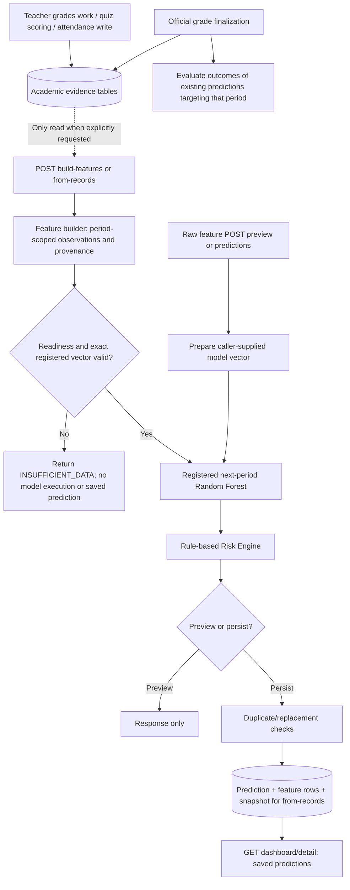

# Prediction lifecycle audit and implementation plan

Audit date: 2026-09-14. This is an audit artifact, not an implementation. No application code, model, features, thresholds, academic records, or database schema was changed.

**Recommendation: disable new CURRENT_PERIOD_PROJECTION generation for school use, retain existing rows as explicitly unvalidated historical results, and use the registered model only for an explicitly identified next-period forecast. Initially require an official finalized source grade, the existing readiness checks, and a valid immediate next period. Add evidence-change detection and explicit refresh with immutable successor versions.** A separately trained and validated current-period model is future work, not a rename of this artifact.

The existing record-based zero-data gate and saved execution snapshots are useful and should be preserved. The major gaps are model semantics, absent refresh/version semantics, incomplete concurrency protection, and a UI that lists predictions rather than the readiness of the enrolled population.

## Verification scope and evidence

I inspected frontend routes/callers, prediction endpoints, evidence/scoring/risk/persistence/read services, grading and finalization services, model registration/training code, checked-in artifacts and data, ORM/migrations, and the configured PostgreSQL database using read-only transactions. Database observations apply to the configured database inspected, not an assumed deployment elsewhere. I did not run seed/import/remediation jobs or retrain anything.

Verification performed:

- **98 existing tests passed** across `test_prediction_feature_builder_service.py`, `test_prediction_persistence_service.py`, `test_prediction_routes.py`, `test_prediction_outcome_grade_finalization.py`, and `test_risk_engine.py`. These use isolated SQLite fixtures; they do not establish PostgreSQL concurrency correctness. One existing Pydantic deprecation warning was emitted.
- An additional in-memory Term 1 probe used the actual checked-in 20-column schema and actual saved model, without fitting it. It exercised zero evidence, 55% coverage without a stored current grade, and 55% with a legitimate stored current grade and no previous period grade.
- A read-only PostgreSQL concurrency probe demonstrated that a waiting repeatable-read transaction's snapshot predates acquisition of its advisory lock. No application rows were inserted or updated for this probe.
- Active registry row: model version **1**, `entervene_next_period_grade_rf`, `RandomForestRegressor`, `data/models/entervene_next_period_grade_rf.joblib`; registered schema matches the checked-in 20-column schema.
- Artifact SHA-256: `15c74a831687aa1e50d947c616fd1114631c491245fa8612e1e42cd903029c69`.
- Inspected database indexes confirm **no unique prediction logical-scope constraint**. The request-ID uniqueness constraint exists. Inspected user triggers concern teacher substitutions only; there is no prediction-generation trigger.
- Frontend conclusions are from actual source/caller inspection, not a browser interaction test. I did not execute a production generation endpoint.

Key source references used throughout this report:

| Reference | Actual implementation |
| --- | --- |
| Builder | [PredictionFeatureBuilderService.py](../backend/app/services/prediction/PredictionFeatureBuilderService.py): `_classwork_rows` 135, `_classwork_metrics` 226, `_prediction_mode` 486, `check_prediction_readiness` 492, `_select_grade_with_provenance` 550, `build_prediction_features_from_records` 606 |
| Scorer | [ModelScoringService.py](../backend/app/services/prediction/ModelScoringService.py): `prepare_feature_row`, `predict_next_period_grade`, `score_student_prediction` |
| Routes | [Predictions.py](../backend/app/api/v1/routes/Predictions.py): `preview_prediction`, `preview_prediction_from_records`, `create_prediction_from_records`, `create_prediction`, `get_latest_prediction` |
| Persistence | [PredictionPersistenceService.py](../backend/app/services/prediction/PredictionPersistenceService.py): `validate_references`, `find_existing_prediction`, `score_and_persist_prediction` |
| Transaction | [PredictionGenerationTransaction.py](../backend/app/services/prediction/PredictionGenerationTransaction.py): `canonical_prediction_scope`, `run_prediction_generation_transaction` |
| Snapshot | [PredictionEvidenceSnapshotService.py](../backend/app/services/prediction/PredictionEvidenceSnapshotService.py): `generation_request_fingerprint`, `_observed_evidence`, `build_evidence_snapshot` |
| Risk | [RiskEngine.py](../backend/app/services/prediction/RiskEngine.py): `evaluate_default_rules`, `compute_risk_score`, `evaluate_risk` |
| Prediction storage | [AIPrediction.py](../backend/app/models/ai/AIPrediction.py), [Phase 1 migration](../backend/migrations/versions/20260911_prediction_evidence_phase1_scope.py) |
| Finalization | [StudentRecordService.py](../backend/app/services/student_record/StudentRecordService.py): `finalize_student_period_grade` 895, `send_student_grade_to_adviser` 1010, `bulk_send_grades_to_adviser` 1218 |
| Outcomes | [PredictionOutcomeService.py](../backend/app/services/prediction/PredictionOutcomeService.py): `_matching_predictions_for_period_grade`, `evaluate_outcomes_for_finalized_period_grade` |
| Dashboard/detail | [DashboardPredictionService.py](../backend/app/services/prediction/DashboardPredictionService.py), [PredictionReadService.py](../backend/app/services/prediction/PredictionReadService.py), [TeacherEvidenceService.py](../backend/app/services/prediction/TeacherEvidenceService.py) |
| Training | [BuildTrainingDataset.py](../backend/app/ml/BuildTrainingDataset.py), [Train.py](../backend/app/ml/Train.py), [training report](../backend/data/models/entervene_next_period_grade_rf_training_report.json), [schema](../backend/data/models/entervene_next_period_grade_rf_feature_schema.json) |

## A. Current behavior

### A1. Actual flow and timing



**Evidence creation is not a prediction trigger.** Readiness is computed during a requested build; it is not a continuously evaluated subscription. The browser normally performs GETs against already saved predictions. A raw feature request skips the builder and its pre-model readiness gate.

All following prediction URLs have the `/api/v1` prefix:

| Trigger / path | Actual behavior |
| --- | --- |
| Open teacher/admin prediction dashboard | `frontend/src/pages/teacher/predictions.tsx` effects call `fetchDashboardFilters`, `fetchDashboardGradeSummaries`, and `fetchDashboardAtRisk` in `frontend/src/lib/prediction-api.ts`. GETs only. No generation. |
| Grade/section drilldown and detail | `grade-predictions.tsx`, `section-predictions.tsx`, `prediction-detail-sheet.tsx` read saved records. No generation request exists in the frontend. Review/intervention POSTs do not create predictions. |
| `POST /predictions/build-features` | Build observations and readiness; no model prediction or persistence. |
| `POST /predictions/from-records/preview` | Build, gate, then execute model and risk if ready; never save. |
| `POST /predictions/from-records` | Separate transaction, scope advisory lock, build and gate; score and persist only if ready. This is the audited record-based creation path. |
| `POST /predictions/preview` | Accept caller features; prepare numeric vector, execute model, then risk. Does not verify academic records or perform builder readiness first. No save. |
| `POST /predictions` | Accept caller features, validate referenced IDs exist, score and persist. No record builder, no evidence snapshot because `evidence_context` is absent. |
| `python -m app.ml.ScorePrediction` | Explicit CLI scoring; no saved `ai_prediction`. |
| `python -m app.ml.SavePrediction` | Explicit CLI invocation of transaction wrapper and persistence service with supplied features. Another snapshot-free creation path. |
| `python -m app.ml.SeedLivePredictions ...` | Explicit import of existing CSV outputs using `bulk_insert_mappings(AIPrediction, ...)`; it does not score live records. Sets source and target to the same mapped period and creates PENDING outcomes. No audited snapshot. |
| `python scripts/score_enrolled_cohort.py ...` | Explicit cohort script builds features but unconditionally constructs an insufficient response; inserts or **updates** baseline `INSUFFICIENT_DATA` rows, clearing grades/features. It is not normal RF batch generation. |
| Demo validator | `scripts/validate_prediction_demo.py` references generation helpers, but currently contains literal diff text and fails compilation at line 87. It is not a functioning automation path in this checkout. |
| Tests / verification fixtures | Can create test rows in their configured test environment. They are not application triggers. |

`main.py` registers the prediction router and does not register a prediction startup job, scheduler, worker, or event subscriber. Searches of application and script callers found no such automatic generation system. “Scheduler” elsewhere includes timetable scheduling; it is not an ML refresh schedule. No external OS scheduler configuration was established by this audit.

Actual evidence writers:

- `PUT /api/v1/submissions/{submission_id}/grade` → `Submissions.grade_submission` → `submission/SubmissionService.grade_student_submission`: updates `StudentSubmission.grade`, status, grader, and `graded_at`; commits and sends a grade-release notification. No prediction call and no `StudentPeriodGrade` refresh.
- `quiz/QuizAttemptService.submit_student_quiz_attempt` writes automatic scores to `StudentSubmission`. `quiz/QuizAnalysisService.grade_teacher_quiz_submission` writes teacher-reviewed quiz scores. Neither invokes prediction generation.
- Classwork create/update/publication paths persist assignments/content. Attendance `POST /api/v1/attendance` and `/scan` use `attendance/AttendanceService`; no prediction call follows them.
- `AssessmentItem`/`StudentAssessmentScore` are read by the builder. The inspected application has no ordinary API writer for `StudentAssessmentScore`; assessment import/test data must not be confused with live classwork grading. Even assessment-row changes have no prediction listener.
- `Settings.py` period activation changes `AcademicPeriod.is_active`; it is not grade finalization and creates no forecast.

Finalization endpoints in `StudentRecords.py`:

1. `POST /student-records/period-grades/{period_grade_id}/finalize` → `finalize_student_period_grade`.
2. `POST /student-records/teacher/classes/{class_id}/subjects/{subject_id}/students/{student_id}/send-to-adviser` → `send_student_grade_to_adviser`.
3. `POST /student-records/teacher/classes/{class_id}/subjects/{subject_id}/periods/{academic_period_id}/send-to-adviser` → `bulk_send_grades_to_adviser`.

These establish official grades and call `evaluate_outcomes_for_finalized_period_grade`. That function finds **already existing predictions targeting the finalized period**, computes outcome errors, and inserts/updates outcomes. It never creates a next-period prediction. There is no single “entire academic period finalized” ML event today.

**Explicit answers:** dashboards do not generate; adding grades does not generate; finalizing grades does not generate; Term 2 starting does not generate; finishing Term 1 does not automatically create a Term 2 prediction. Normal online generation requires an explicit endpoint request, but CLI/import scripts are additional explicit database-writing paths.

### A2. Term 1 cold start and exact eligibility

For a student with no grade row, no assessment scores, no eligible classwork, and no attendance:

| Value/state | Actual value |
| --- | --- |
| `source_period_grade` | `None` |
| Component percentages | `None` |
| `assessment_completion_rate` | `None`, `NO_EXPECTED_ITEMS` |
| `data_coverage_ratio` | `None`, `NO_EXPECTED_ITEMS` |
| `has_previous_period` | `False` |
| `grade_trend_vs_previous_period` | `None` as an observation |
| `cumulative_period_grade_avg` | Key omitted when there are no usable stored grade rows |
| Behavioral score without any signals | `None`; behavioral cold-start flag true |
| Record-based result | `ready=False`, `readiness_level=INSUFFICIENT`, grade `null`, risk/data status `INSUFFICIENT_DATA`; no saved row |

The exact first blocking reasons are “Source period grade is not available,” “Activity completion evidence is unavailable,” and “Grade coverage evidence is unavailable.” Scoring is not reached. Adding only attendance cannot satisfy these academic requirements.

Readiness requires all of:

1. Non-null source grade.
2. Resolved completion, at least 0.50.
3. Resolved coverage, at least 0.50.
4. A valid active registered schema and complete numeric prepared model vector.

The levels remain MINIMUM at 50–<70%, GOOD at 70–<85%, STRONG at >=85%. Coverage alone does not prove readiness. Required component percentages and cumulative average can still be absent. Median imputation inside the saved pipeline does not rescue this: `prepare_feature_row` rejects missing/non-numeric runtime values before `model.predict`.

**No previous period is not a prohibition.** The builder finds comparable previous periods within the same year and period type; it does not look into an earlier school year. In Term 1, `has_previous_period=False`; the model preparation maps the absent trend to 0, while preserving the observation as absent. This is the existing no-history model representation, not fabrication of an academic grade. The risk engine also triggers `no_previous_period`, recommending monitoring; it does not block scoring.

The cumulative average includes usable stored `StudentPeriodGrade` rows **through the source period**, not just earlier periods. Therefore, a genuine Term 1 stored grade can supply the cumulative average by itself. It need not be a previous-term grade or finalized to pass the current implementation.

The source-grade precedence is:

1. Finalized non-null `final_period_grade` → OFFICIAL.
2. Otherwise first non-null `final_period_grade`, `transmuted_grade`, `initial_grade` → RECORDED_PROVISIONAL.
3. Otherwise mean of available component percentages → ESTIMATED.
4. No components → no grade.

Legitimate zeros are retained. The estimate is an equal-component mean, not the official weighted/transmuted gradebook formula. Critically, this estimated grade is **not** inserted into the cumulative average. With no grade rows at all, even otherwise complete classwork evidence remains blocked by missing `cumulative_period_grade_avg`.

Observed in-memory probe:

| Case | Result |
| --- | --- |
| True zero data | Blocked with the three missing academic-evidence reasons above |
| 11/20 graded and completed activities, all three components, no stored grade | Estimated source 80; coverage/completion 0.55; blocked: missing required cumulative average |
| Same records plus a genuine stored current grade of 80, no previous grade | MINIMUM/ready; cumulative 80; RF score 84.64 |
| Same ready case, no attendance/due dates | Behavioral score 55 from completion alone; risk HIGH_RISK; data status COLD_START |

The last row exposes another documentation error: no attendance/due dates does **not** necessarily make behavioral engagement null or disable behavioral rules. Available completion is weighted to 100% of the composite when it is the only signal. The cold-start flag is a separate label. This audit proposes documenting that behavior, not changing the Risk Engine.

### A3. Current-period versus next-period semantics

Training constructs one row from a source period's grades and components and uses the next available period's grade as `target_next_period_grade`. The checked-in pipeline has 300 RF trees, `random_state=42`, `min_samples_leaf=2`, median imputation, and `n_jobs=-1`. No partial-current-period → final-same-period training/evaluation pipeline was found. The active registry selects the same artifact for both modes.

For a same-period request the builder sends exactly its source evidence: source grade selected by the precedence above, current component percentages, classwork completion, normalized period sequence, grade level, history/trend/cumulative values, and subject flags. **The target period and prediction mode are not model inputs and do not select another artifact.** An OFFICIAL source grade is also allowed for a same-period request; the claimed provisional-only restriction is not enforced.

There is a further concrete labeling bug:

```python
if target_period_id is None or target_period_id == source_period.academic_period_id or source_period.is_active:
    return "CURRENT_PERIOD_PROJECTION"
```

An active Term 1 source with a distinct Term 2 target is labeled CURRENT_PERIOD_PROJECTION. This was reproduced. Conversely, an inactive source and any different existing target get NEXT_PERIOD_PREDICTION, even if the target is earlier or in another year/type. Persistence checks existence, not adjacency/order/year/type. The mode is not a first-class stored column and is not included in the snapshot contract.

**Yes: the application presents an unvalidated same-period interpretation of a next-period model.** Renaming variables would not fix it. Choose **A now** (disable new same-period school-facing scoring) and **C later** (a separately validated model). Option B is only suitable for an explicitly separated research demonstration, with no implication of validated school predictions and no pooling into next-period accuracy metrics.

Requiring OFFICIAL source grades for new next-period generation is a source-provenance policy, not a threshold or feature change. Partial-source → next-period forecasting is also not established by the present validation report. Mathematical/schema compatibility is not validation of that use case.

### A4. What happens when grades change after V1

At 10:00 a saved 84.30/NEEDS_MONITORING prediction is an old result. At 14:00 a teacher grades another exam:

- The grade/submission records change. The saved `ai_prediction`, its feature rows, and snapshot do not change through that grading path.
- There is no automatic successor, stale marker, comparison to live evidence, notification of stale predictions, or refresh button.
- GET dashboard/detail continues returning V1. Audited detail reads snapshot evidence rather than rebuilding it, which is correct for history.
- Calling from-records again first builds **new** evidence and checks its current readiness. If now insufficient, it returns an insufficient response and leaves V1 untouched.
- If ready, persistence scores again, finds the existing same student/class/subject/source/target/model-version row, and by default returns that old prediction with `duplicate=True`.
- **Response integrity bug:** the duplicate response combines V1's stored grade/risk with reasons from the new scoring result; the route then adds the newly built features, readiness, and evidence summary. This can describe evidence that did not produce V1.
- `replace_existing=True` raises a 400 error for an audited row. For a legacy row without a snapshot, it replaces grade/risk/features in place. `generated_at` is not refreshed in that branch. Existing outcome/review links remain attached to that ID.
- Reusing a `generation_request_id` returns the prior row without re-scoring inside persistence. However, from-records has already rebuilt/gated evidence before that lookup, so this is not unconditional replay of the original request. Its response may still attach current evidence. If current readiness fails, replay does not reach the existing result at all.
- For record-based requests, request-ID fingerprint comparison covers identifiers and model **name**, not content or model version. For raw-feature requests, even that mismatch check is skipped because it is conditional on `evidence_context`.
- A different model version is a different duplicate-search scope and can yield another row; the dashboard does not resolve these to one current prediction.

Normal grade writes preserve snapshots, but **immutability is currently a service convention, not a database guarantee**. The baseline cohort script can overwrite an audited row's result/features without rejecting or replacing its old snapshot. This would make the row contradict its own evidence. Direct SQL/ORM writers also lack a database immutability guard.

### A5. Evidence cutoff and provenance limits

The repeatable-read generation transaction freezes one consistent database view. Saved ordered model values and risk inputs are good replay evidence. The snapshot records `captured_at`, source/target names/boundaries, observed feature values, counts, some IDs/raw records, model digest, readiness, and rule trace.

However, `scope.generation_cutoff` is the attendance cutoff **date**, `min(today, source.end_date)`. It is not a universal timestamp for all academic evidence. Classwork/assessment/grade queries read the transaction-visible rows and do not reconstruct their contents as of that date. A late correction to Term 1 read months later is current transaction evidence even though the attendance cutoff says Term 1's end date. `captured_at` is generated after scoring, not the exact instant the MVCC snapshot was acquired.

The exact frozen vector is preserved, but source-level reconstruction is incomplete: component values, cumulative grades and trend lack complete corresponding raw-record provenance in `observed_evidence`; some assessment IDs are assembled separately but not attached to the relevant feature entries. Grade rows/submissions have no general immutable revision history. Do not promise historical as-of rebuilding from timestamps.

### A6. Three-term curriculum

[AcademicPeriod.py](../backend/app/models/academic/AcademicPeriod.py) stores `total_periods_in_year`; ORM insert/update listeners call [AcademicPeriodService.normalize_academic_period_values](../backend/app/services/AcademicPeriodService.py). TERM defaults to 3, QUARTER to 4, SEMESTER to 2. Explicit custom totals can be retained by the normalizer; the standard create/update service uses the configured type's standard total. The builder reads the stored source row's total, not a frontend term count.

| Source | Inference `period_sequence = round(sequence / total * 4, 4)` |
| --- | --- |
| Term 1 / 3 | 1.3333 |
| Term 2 / 3 | 2.6667 |
| Term 3 / 3 | 4.0000 |
| Quarter n / 4 | n |

Record-built inference uses this mapping. Raw feature endpoints, SavePrediction and imported prediction outputs do not enforce it. Training CSV source sequences are **1, 2, 3**, because next-quarter targets need a successor; Q4 is a target, not a training source. Thus normalized Term 3 = 4 is outside those observed source sequence values. Nothing in the report validates three-term forecasts, changed term duration, or this scaling policy.

There is **no automatic next-period selector** in prediction generation: the caller supplies the target ID. A nonexistent target is rejected, but an existing unrelated/earlier/cross-year target is accepted. Standard term creation rejects sequence 4 with total 3, yet the predictor does not enforce “Term 3 has no next term.” The safe future behavior is NO_NEXT_PERIOD after Term 3, with outcome evaluation of forecasts targeting Term 3 still performed. Cross-year forecasting is out of scope; never invent Term 4.

### A7. Model/risk variability and limitations

| Evidence/input | Effect of a new grade under current builder |
| --- | --- |
| `source_period_grade` | Changes only if selected stored grade changes, or if using component estimate. A stored grade takes precedence and is not updated by individual submission grading. |
| Written work / performance task / quarterly assessment percentages | Classwork earned/possible totals use selected submissions with non-null grade and total points. Assessment components are used only if no eligible classwork rows exist; missing components can fall back to a grade row. A new assessment score can therefore have no effect when classwork is the selected source. |
| `assessment_completion_rate` | Count of selected statuses submitted/graded/late divided by eligible assignments. Submitted → graded need not change it. Pending → graded can. |
| Coverage | Count with non-null grade and total points divided by eligible assignments; adding assignments changes the denominator too. Not “percentage of the whole term curriculum completed.” |
| Missing activity count | Counts explicit `missed` status; absence of a submission or pending status is not counted as missed here. Grade entry can remove a missed status. |
| Late submission count | Uses due date, submitted timestamp and late status. A grade-only change usually does not alter timing. Missing timestamps/ambiguous attempts can make this unavailable. |
| Behavioral engagement | Weighted available attendance, on-time and completion signals. Completion changes can change risk even with no model-grade change. |
| Trend | Source grade minus selected previous comparable grade; no-history observation stays absent. |
| Cumulative average | Stored period-grade values through source only; a submission grade alone does not update it. |
| Readiness | Coverage/completion and complete model-vector availability; can improve or regress when assignments/attempts change. |

`missing_activity_count`, `late_submission_count`, coverage, attendance, and behavioral engagement are not among the RF's 20 features; they are risk/supporting evidence. Completion is an RF input as well as a direct/composite risk input. The RF grade and risk classification can change independently. A changed RF feature does **not** guarantee changed output: the trees can follow the same leaves, and rounding can hide a small change.

Reproducibility probe: 20 predictions of the identical first test vector produced the same saved value **92.00**. Raw outputs differed by at most `5.684341886080802e-14` with `n_jobs=-1`. The registered model is reproducible at application precision; it is not a random draw on each request. Exact bit equality is not the appropriate invariant for parallel floating-point reduction.

Verified artifact/data results:

- Training rows 1,580; test rows 395; both target ranges **80–99**, both below-75 counts **0**.
- Saved report: MAE **1.4892308526**, RMSE **2.0558795662**, R² **0.6598456335**, student overlap 0.
- Running the registered artifact on its checked-in test CSV yields prediction range approximately **83.6424–98.2267**, not the handoff's 83.46 lower bound. This is a test-set observed range, not a claim about every possible input.
- The regressor's leaves average training targets; these data do not establish prediction of failing-grade outcomes. Strong current low-grade or behavior-related risk can arise from the rule engine even when the RF predicts a passing grade.
- Risk scores are rule scores, not failure probabilities or model confidence. No current-period or three-term validation cohort is provided by this report.

### A8. Current UI and documentation discrepancies

Admin and teacher prediction routes reuse the same three teacher-page components through `frontend/src/App.tsx`. Dashboard queries start from `AIPrediction`, not the enrolled roster with an optional prediction. A newly enrolled zero-data student with no prediction is absent. Seeded insufficient rows show “Insufficient Data” and a dash for grade/risk. The detail sheet says prediction unavailable, but it is reachable only with a prediction ID.

`prediction-table.tsx` currently says **“No predictions match the selected filters. All students in this query scope are currently on track.”** Absence of predictions cannot establish that conclusion. The detail headline is simply **“Predicted Grade.”** It shows generated time and saved evidence labels, including source-grade provenance, but does not give an explicit source/target/type/readiness/cutoff/freshness summary or refresh/history controls. Snapshot evidence percentages are displayed, but readiness levels and completeness of the entire term are not the same thing.

The prediction API is restricted to admin/teacher. No student prediction dashboard/generation path was found; student intervention pages can show linked interventions, not a readiness experience. Do not claim students currently see “Collecting evidence.”

Generation authorization uses the **source** teaching assignment; dashboard/detail/review scope uses the **target** assignment. A Term 1 teacher may generate a Term 2 forecast but not be able to inspect it if Term 2 load is absent/different. This needs an explicit server-side access policy before automated handover.

A separate routed admin page, `frontend/src/pages/admin/student-view.tsx`, contains hardcoded “Likely to Fail,” “81% model confidence,” and “the model predicts failure with high confidence” text. It is a mock page, not the RF response, but it directly violates the required school-facing interpretation and must not be presented as live evidence.

Differences from [ML_HANDOFF.md](ML_HANDOFF.md) and Phase 1 ticket prose:

- “Same active period” / provisional-only current projections are described but not enforced; active source can override a distinct target in the label.
- Cold start can have non-null participation and behavioral risk from completion alone.
- “None required” for history is conditional on a complete vector, including a current stored grade for the existing cumulative builder.
- Cumulative average includes the source period, not only previous periods.
- “50% expected assessments” misstates the classwork-only denominator; assessment records alone cannot satisfy coverage/completion.
- “Before the model runs” applies to from-records, not raw-feature routes.
- Normal persistence does not initialize a PENDING outcome row; the seed importer does. Normal outcome rows are created upon evaluation.
- The handoff contains older 938/231 dataset counts, 16-feature prose, and older 1.93/2.45/0.584 metrics alongside current values. The report/schema are authoritative.
- MAE is an average error, not a per-student ±MAE prediction interval.
- Phase 1 requirements to save readiness-only evidence and cover all creation adapters were not completed universally: from-records skips persistence when insufficient and raw/import adapters bypass snapshots.
- Serialization is implemented, but the documented duplicate guarantee is stronger than the transaction/constraint combination provides.

## B. Scenario matrix

“Should run?” below refers to the recommended school-facing use of this registered next-period model. “Technically ready” describes the existing implementation and does not establish model validity. Percentage cases assume completion also meets its threshold unless stated otherwise.

| Scenario | Should model run? | Current behavior | Recommended behavior |
| --- | --- | --- | --- |
| Term 1, zero evidence | No | From-records blocks: missing source, completion, coverage; no row created | Roster status COLLECTING_DATA, no numeric prediction or invented academic values |
| Term 1, 30% evidence | No | Blocks coverage/completion below 50% | Show collecting evidence, actual assigned-activity coverage and reasons |
| Term 1, 55%, no previous term | Not as a same-term forecast; next-term only after official source and other gates | MINIMUM only with full schema. No stored current grade means missing cumulative average; complete stored current grade can make eligible without previous history | Preserve exact gate; show academic readiness separately from “next-term forecast awaits official source grade” |
| Term 1, 90% evidence | Same restriction | STRONG if full vector/other gates; no automatic score; estimated-only case can still fail | Show strong evidence, but do not present unvalidated same-period output |
| New exam graded after prediction | No automatic per-write execution | V1 unchanged; no stale flag; repeats return V1 or replacement error | Detect changed source evidence; keep V1; explicit refresh can create V2 if forecast scope remains valid |
| Term 1 finalized | Yes, conditionally | Official grade saved and existing target-Term-1 outcomes evaluated; no Term 2 forecast | Resolve Term 2; validate official source/vector; one idempotent generation attempt per student/subject |
| Term 2 begins | No duplicate just because term starts | Activation only; existing rows read | Display existing Term-2 forecast based on Term 1; expose missing forecast as pending/unavailable |
| Term 2 evidence changes | No blind execution | No regeneration; another manual request for Term 2 source would use that source | Do not mark Term1→Term2 stale merely because target Term2 grades changed. Term2 evidence prepares Term2→Term3; source-Term1 corrections can stale Term1→Term2 |
| Term 3 finalized | No Term3→Term4 forecast | Outcomes can be evaluated; no automatic generation; callers can still supply an invalid relationship between existing IDs | Evaluate forecasts targeting Term 3; return NO_NEXT_PERIOD; do not invent Term 4 or silently roll to another year |

The distinction in the Term 2 row is essential: newer **target** evidence is not newer **source** evidence for the same forecast. Refreshing a Term1→Term2 forecast with Term2 features would silently change the estimand.

## C. Problems found, severity, and evidence

Severity: Critical = can misrepresent or corrupt an audited result; High = invalid forecast/lifecycle behavior or material teacher confusion; Medium = incomplete provenance/operational clarity.

| Category | Severity | Finding and concrete evidence |
| --- | --- | --- |
| MODEL VALIDITY | Critical | Same-period interpretation uses the next-period artifact without corresponding validation. Builder mode does not alter scorer; training target is next-period. |
| MODEL VALIDITY | High | No failing targets; quarter-derived evaluation is not three-term or partial-period validation. Verified CSVs/report and normalization code. |
| BACKEND LOGIC | High | Active source forces CURRENT label even with a different target; existence checks allow invalid relationships. `_prediction_mode`, `validate_references`. |
| BACKEND LOGIC | High | Raw endpoints bypass record readiness/provenance and teacher scope checks used by from-records. `create_prediction`, `preview_prediction`. Valid numeric caller features can score despite no real student evidence. |
| BACKEND LOGIC | Critical | Duplicate response can pair old result with new reasons/evidence; readiness is checked before idempotent replay. Persistence duplicate branch and route `_with_readiness`. |
| BACKEND LOGIC | High | Classwork-only estimated source cannot supply required cumulative average; normal individual grading does not materialize a current grade row. Builder cumulative query and submission writer. Do not fix this by fabricating history. |
| BACKEND LOGIC | High | “Graded” coverage checks grade presence, not finalized scoring authority. `QuizAttemptService` writes a numeric partial automatic score for quizzes still awaiting manual answers; `_classwork_metrics` counts it as covered. This needs a separate explicit evidence-authority decision/tests before changing population semantics. |
| DATABASE/PERSISTENCE | Critical | Repeatable-read snapshot acquired before waiting lock finishes; no unique logical scope. Read-only PostgreSQL probe and live index inspection. Duplicate races remain possible. |
| DATABASE/PERSISTENCE | Critical | Audited immutability bypass via cohort script; legacy replace mutates results and leaves audit relations attached. No DB immutable-payload guard. |
| DATABASE/PERSISTENCE | High | No versions/latest selector; `one_or_none()` assumes one row per scope, while table permits multiples. Dashboard reads all predictions and can count one student in multiple risk bands. |
| DATABASE/PERSISTENCE | Medium | Attendance date masquerades as generation cutoff; not full academic evidence timestamp; some raw provenance absent. Snapshot/builder. |
| AUTOMATION/TRIGGERS | High | Finalization evaluates outcomes only; no next-term generation or refresh job. All three finalization services. |
| AUTOMATION/TRIGGERS | Medium | Demo validator currently cannot execute; compilation fails at literal patch text, line 87. |
| FRONTEND/UX | High | Zero-data students without saved rows absent; empty table implies everyone is on track. Dashboard base query and table empty state. |
| FRONTEND/UX | High | No explicit forecast period/type/readiness/cutoff/staleness/history/refresh summary. Generic grade label. |
| FRONTEND/UX | Critical | Routed mock admin student page claims 81% model confidence of failure without such a model output. |
| FRONTEND/UX | High | Source-versus-target teacher authorization inconsistency blocks legitimate forecast handover. Route scope guard versus detail/dashboard target load. |
| DOCUMENTATION | High | Operational readiness, mode restrictions, cold start, outcome initialization, concurrency and model metrics contain contradictions described above. |

Two safeguards already work and should not be undone: zero-data from-records does not score/save a fake prediction, and audited detail uses the saved evidence rather than silently rebuilding history. Grade-history year/type/sequence filtering, legitimate-zero preservation, ambiguous-attempt blocking, ordered model-vector validation, artifact digest and rule trace are also valuable existing protections.

## D. Recommended smallest stable lifecycle

### D1. Eligibility and meaning

Separate **evidence readiness**, **forecast eligibility**, and **saved forecast freshness** in the API. They answer different questions.

1. Build observations using existing features and thresholds. Return reasons when academic evidence/model inputs are missing.
2. Resolve a forecast relationship on the server: same academic year/type, target sequence exactly source+1, source sequence below total, actual target row present, consistent class/year/subject scope. Verify student enrollment/subject scope and permitted teacher access. Do not derive target by ID arithmetic.
3. For the current registered model, require OFFICIAL source grade and an unevaluated/not-finalized target for new school-facing next-term scoring. Do not generate a forecast after its target outcome is already known. A missing target/source grade is a pending/ineligible state, not a fictional period/value.
4. The output means “Predicted Term 2 grade, based primarily on finalized Term 1 evidence.” Three-term use retains an explicit prototype limitation. Current grades, activity counts and readiness can be displayed before finalization without running the unsuitable same-period model.

These policy guards do not change the 50/70/85 readiness cutoffs, risk thresholds, RF features, or grading formula. They deliberately reduce unsupported forecasts.

### D2. Refresh strategy comparison

| Strategy | Benefits | Costs / recommendation |
| --- | --- | --- |
| Explicit teacher Refresh Prediction | Predictable, small implementation, intentional audited executions | Teacher must know evidence changed; use with freshness status |
| Detect evidence changes, let teacher refresh | Predictable, transparent, no grade-write fanout | Requires authoritative comparison; **recommended baseline** |
| Event-driven debounce/batching | Can combine many writes | Requires durable queue, retry/coalescing policy and more concurrency handling; defer |
| Scheduled regeneration | Bounded frequency, operational recovery | Scheduler/worker and hidden refresh times; defer for thesis scope |
| Meaningful milestone generation | Natural handover point | Use **official grade finalization**. Publication alone does not prove enough graded evidence; do not make it an automatic ML trigger yet |

For 30 bulk-encoded grades: 30 academic writes, **zero prediction writes**, one latest status calculation on subsequent load/check, then at most one new version for each intentionally refreshed logical scope. Repeated clicks/request retries reuse the same result. A different student's forecast is a different scope; class batch generation can legitimately create one forecast per student.

For the thesis implementation, derive freshness on dashboard/detail/status reads using a canonical evidence fingerprint. Reuse the builder's extraction rules, separating extraction from scoring eligibility; do not score during a status GET. Hash stable source observations relevant to the forecast, ordered record IDs/values, states/provenance, prior-grade dependencies, and contract identity. Exclude capture times, request IDs, random ordering, and UI descriptions. Record the hash in the immutable snapshot. Equal feature vectors can still have different evidence provenance and justify a successor; equal evidence should not create a new version merely because the clock changed.

Compare only the original source scope and its genuine dependencies. Attendance corrections can affect saved risk and should have an accurate “source evidence changed” reason; do not label every change a new grade. Target-period grades alone must not stale the prior-term forecast. Missing/deleted/ambiguous evidence can make V1 stale while making V2 unavailable; continue showing V1 explicitly as historical until resolved. Legacy rows without comparable snapshots have UNKNOWN freshness.

This requires neither a `stale_at` column nor hooks on every grade writer. It detects freshness when checked, not the exact time evidence first changed; the UI must not claim real-time tracking. Optimize batched reads only if profiling proves necessary.

### D3. Minimal successor schema and concurrency design

Keep each existing prediction ID, result, feature rows, snapshot, reviews, interventions and outcome links. Do not transform V1 into V2 in place.

Proposed minimum ordering addition: **one immutable `revision` integer per prediction scope**, with a unique index on `(student_id, class_id, subject_id, source_period_id, target_period_id, model_version_id, revision)` and positive-revision constraint. All newly generated audited predictions require a model version. The latest is the maximum revision within that exact scope. This permits multiple versions but one unambiguous latest. Different models remain distinct series; the dashboard's default model-selection policy must be explicit rather than combining risk rows from multiple versions.

Before migration, inspect existing duplicate scopes and null model versions. Preserve all IDs. Historical rows can receive deterministic ordering by `(generated_at, prediction_id)` within their scope, clearly documented as legacy ordering, not proof of a historical evidence version chain. Null-model legacy records must remain explicitly legacy and outside the new registered-model series; the migration must define their uniqueness treatment rather than rely on nullable unique-index behavior. Do not guess a missing model identity.

Do **not** also add `is_latest`, `supersedes_prediction_id`, and `superseded_by_prediction_id`: latest/previous/next can be derived from scope plus revision. If later product requirements need branching/model-migration lineage, revisit a relation then.

Store new `evidence_cutoff_at`, canonical evidence fingerprint, and `generation_reason` in the existing versioned snapshot JSON. The cutoff is the evidence capture boundary after acquiring the scope lock, with attendance's date cutoff separately named. Preserve model digest/ordered values and snapshot-version compatibility. No dedicated cutoff/reason columns are initially necessary unless indexed querying is required. Use MANUAL_REFRESH and PERIOD_FINALIZED now; do not implement unused scheduled/event reasons as behavior.

Generation sequence:

1. Authorize and canonicalize identifiers before reading protected data.
2. Acquire the scope lock **before** establishing the repeatable-read evidence snapshot. One practical correction is a session-level advisory lock on a dedicated connection, then a fresh RR transaction on that same connection; explicitly unlock in `finally` and never return a still-locked connection to the pool. The old xact-lock-inside-RR sequence is not sufficient.
3. Resolve/pin model version once. Check request-ID replay and scope fingerprint before rebuilding/gating evidence. Replay the original persisted result and original evidence, not mixed live fields.
4. Build and validate evidence; compare its canonical fingerprint against the latest version. If unchanged, return latest as an explicit no-change result.
5. Assign next revision under lock and insert a new prediction/snapshot atomically. The unique revision index is the independent database race backstop. Request-ID uniqueness remains a second backstop; handle concurrent collisions by deterministic replay/conflict, not a generic server error.
6. Return explicit CREATED, UNCHANGED, REPLAYED, NOT_READY or INVALID_SCOPE outcomes. A request key reused for a different scope/intent must conflict consistently for all adapters.

The transaction-lock defect was reproduced with a waiting RR snapshot `6439:6439:` and a transaction ID 6439 committed before lock release: `txid_visible_in_snapshot` returned false. Existing concurrency tests only verify callback serialization and lock release; add tests of **committed-row visibility and persisted-row counts**, not merely ordering.

Protect audited result/snapshot/feature payloads against UPDATE through all application/maintenance paths. A narrow database immutability guard is justified because an actual script currently bypasses the service. This guard is distinct from a trigger that performs ML scoring. Lifecycle ordering metadata backfill must precede the guard, and tests must ensure normal outcome/review inserts remain allowed. No existing audited payload should be rewritten to retrofit missing provenance.

### D4. Next-period generation at finalization

Use application orchestration around **all three official grade-finalization paths**. Do not place RF execution in a raw PostgreSQL trigger.

An application service can validate model/provenance/period relationships, explain missing evidence, enforce teacher authorization, pin an artifact, use the generation transaction, and return individual success/failure information. A scoring DB trigger would hide expensive external-artifact execution inside arbitrary grade writes, complicate bulk imports and retries, and couple grade commits to ML availability.

For the smallest implementation, commit the official grade and existing outcome evaluation first, then make an explicit synchronous generation attempt per finalized scope through the shared generator. Return the grade-finalization result plus per-scope forecast status. An unavailable model or insufficient evidence must not discard the official grade or pretend a forecast succeeded.

This post-commit attempt has a crash window; it is **not durable exactly-once delivery**. Make missing forecasts observable by deriving pending finalized scopes with no appropriate forecast, and support an explicit “Generate missing next-term forecasts” retry action plus idempotent retry of finalization. If reliable unattended recovery becomes a requirement, add an outbox written in the grade transaction and a worker later; do not introduce that infrastructure implicitly now.

For an unchanged repeated finalization, use stable source-grade/evidence identity, not a freshly changed `finalized_at` timestamp, to avoid another version. For an actual approved correction, preserve V1 and allow a successor. Finalization currently rewrites its timestamp on retry, so timestamps alone are not safe idempotency keys. The generated type comes solely from the validated source/target relationship; `source.is_active` must not convert the event to a Term 1 projection.

Resolve actual Term 2 before attempting Term1→Term2. After Term 3, return NO_NEXT_PERIOD and still evaluate target-Term3 outcomes. If Term 2 does not exist yet, surface NEXT_PERIOD_NOT_CONFIGURED, without adding a period or silently substituting the source.

### D5. Teacher experience and outcome auditing

The backend should return teacher-facing forecast context with source/target labels, type/validation status, generated time, evidence cutoff, readiness level/coverage, source-grade provenance, current evidence status, revision and history availability. The frontend renders this contract; it does not reproduce readiness thresholds or scope validation.

| Situation | Recommended wording |
| --- | --- |
| No academic records | “Collecting evidence · Prediction unavailable · No graded activities recorded.” |
| 42% observed coverage | “Collecting evidence · 42% of assigned graded activities have recorded scores.” Include the actual blocker; avoid implying 42% of the full curriculum. |
| MINIMUM ready evidence | “Minimum evidence available · Coverage: 58%.” If not yet official, add “Next-term forecast awaits the official Term 1 grade.” |
| STRONG evidence | “Strong evidence available · Coverage: 91%.” Coverage is not a model confidence level. |
| Saved next-term forecast | “Predicted Term 2 Grade · Based primarily on Term 1 academic evidence · Official source grade.” |
| Source evidence changed | “New source academic evidence is available · Prediction generated: [time] · Evidence cutoff: [time] · Refresh prediction.” |
| Legacy/current-period historical result | “Historical unvalidated projection” plus unavailable provenance/freshness where applicable. Do not relabel it as a validated next-term result. |

Show snapshot coverage/readiness separately from current readiness when they differ. Preserve V1 detail/history after V2 becomes latest. Do not put a zero-data placeholder into `ai_prediction` merely to make a student appear: use a roster-based status response with nullable prediction ID.

Retain target-period matching in outcome evaluation and evaluate **all applicable historical versions**, not only latest. Reviews/interventions remain attached to the reviewed version and are not copied as approval of V2. `ModelPerformanceService` currently aggregates all evaluated rows; before introducing successors, distinguish per-version audit results from a predeclared evaluation cohort (for example, first eligible official-source forecast per target). Do not silently pool same-period, next-period, legacy, and repeatedly refreshed results into a claim of validated next-period accuracy. Freeze the cohort policy before selecting results; do not choose versions based on observed error.

The new student UI is not required to solve this teacher/admin task. If student readiness is later exposed, add a separately authorized, student-scoped response; do not open teacher prediction endpoints to students.

## E. Exact implementation plan — proposed, not applied

Each item states problem → current behavior → proposed behavior → necessity → files → migration/API impact → tests. Implement in this order, with no RF retraining or threshold/feature changes.

### E1. Enforce forecast purpose, relationship and access

- **Problem/current:** Same-period model misuse, active-source labeling bug, unconstrained target relationship; raw routes bypass trusted records and source assignment checks.
- **Proposed:** Add shared forecast-scope/purpose validation; reject new same-period school scoring; require immediate valid successor and official source for this model; pin the model version. Use the same scope/access validation for generation and reads. Explicitly permit the appropriate source teacher to inspect forecasts they generate and the target teacher to inspect handover forecasts; keep review/write permission separately scoped. Retire raw persist from normal teacher/admin production use or make it explicitly fail as unsupported; keep any diagnostic raw preview restricted and clearly unaudited, with pre-model input readiness checks.
- **Why:** A valid numeric vector is not a valid school forecast, and teachers need consistent access to results.
- **Files:** `services/prediction/PredictionFeatureBuilderService.py::_prediction_mode`; new small `PredictionScopeService.py`; `PredictionPersistenceService.py::validate_references`; `api/v1/routes/Predictions.py`; `schemas/Prediction.py`; `PredictionReadService.py`; `DashboardPredictionService.py`; `TeacherRiskReviewService.py`; `TeacherAssignmentResolver.py`; CLI `SavePrediction.py`.
- **Migration/API:** No model migration. Add typed context/rejection responses and deprecate raw production persistence. Existing same-period rows remain unchanged/readable with a legacy validation label.
- **Tests:** Active Term1→Term2 classified correctly; same-period/backward/skipped/mixed-year/mixed-type/nonexistent targets blocked; Term3 no successor; student/class/subject mismatch; source/target teacher permissions; raw feature bypass denied; official versus provisional/estimated provenance.

### E2. Centralize generation, replay and capture

- **Problem/current:** Old results can be returned with newly scored explanations; replay happens after readiness; capture date is mislabeled.
- **Proposed:** One generation service resolves replay first, then builds/gates/scores/inserts; serialize response from persisted result/snapshot. Separate current status from saved result. Capture a clearly named evidence boundary and complete relevant raw provenance; preserve observed-null versus prepared-trend-zero explicitly in transformation trace.
- **Why:** Prediction result and evidence must refer to the same execution. No synthetic missing grades or history are required.
- **Files:** New `PredictionGenerationService.py`; `PredictionPersistenceService.py`; `PredictionEvidenceSnapshotService.py`; `PredictionFeatureBuilderService.py` (extract reusable evidence capture); `ModelScoringService.py` (trace only, numerical behavior unchanged); routes/schemas; `TeacherEvidenceService.py`.
- **Migration/API:** Version the JSON snapshot contract; additive API fields. Old snapshots remain readable; no reconstruction/backfill of evidence. Existing generation_request_id retained.
- **Tests:** Replay after evidence becomes insufficient; replay after model activation changes; same key/different scope conflicts for every adapter; duplicate response contains only old evidence; all capture/scoring/persistence failures roll back; exact vector/observations survive later grade mutations.

### E3. Add append-only ordering and fix concurrency

- **Problem/current:** No successor support or unique ordering; RR lock wait can see stale state; service-only immutability is bypassable.
- **Proposed:** Add revision and scoped uniqueness with a reviewed legacy/null-model policy; acquire advisory lock before the RR snapshot; insert successors only; derive latest/previous/next by revision. Add narrow audited-payload mutation guards and route operational writers through the shared generator or prevent them from touching audited rows.
- **Why:** Guarantees one deterministic current result without overwriting history, including simultaneous refresh/finalization.
- **Files:** `models/ai/AIPrediction.py`; one purpose-specific Alembic migration after preflight; `PredictionGenerationTransaction.py`; `PredictionPersistenceService.py`; `PredictionReadService.py`; `DashboardPredictionService.py`; `scripts/score_enrolled_cohort.py`; `app/ml/SeedLivePredictions.py`; `scripts/remediate_insufficient_data_predictions.py` (explicit immutable-row exclusion).
- **Migration/API:** One revision column plus scoped index/check and narrowly scoped payload guard; do not add redundant latest/stale/successor columns. Expose revision/history and select latest consistently in all lists/aggregations. Preserve prediction IDs and outcome FKs.
- **Tests:** Real PostgreSQL two-session committed-row visibility; same-key concurrent replay; different keys/same evidence; simultaneous manual/finalization generation; revision conflict handling; rollback/unlock and connection-pool cleanup; audited result/feature/snapshot mutation rejected; legacy rows and outcomes survive migration; one latest row per model scope.

### E4. Add read-only readiness/freshness and explicit refresh

- **Problem/current:** No saved row means no student in prediction UI; new evidence is invisible; refresh cannot create V2.
- **Proposed:** Server roster-based status endpoint with nullable prediction and canonical fingerprint comparison; explicit refresh endpoint/action uses shared generation service. No scoring in GET and no per-grade regeneration. Preserve existing classwork population and no-history blocking rules in this lifecycle change.
- **Why:** Makes collecting/ready/stale states visible without creating fake predictions or 30 versions during grade entry.
- **Files:** New `PredictionStatusService.py`; extraction helpers in builder; snapshot service; dashboard/read services; routes/schemas; `frontend/src/lib/prediction-api.ts`.
- **Migration/API:** No stale columns or writer timestamp migrations. Add status/refresh/history contract; store fingerprint in new snapshots. Legacy freshness UNKNOWN.
- **Tests:** Zero-data enrolled student appears without insert; 30%/55%/90% with incomplete and complete schemas; assessment-only blocked; no-history current grade case; zero values; new/edited/deleted assignment, corrected prior/source grade and attendance; unrelated target-period change does not stale source forecast; same canonical evidence no successor; 30 writes yield zero predictions until explicit request.

### E5. Integrate the official-grade milestone

- **Problem/current:** Three finalization paths evaluate outcomes but never produce the next forecast.
- **Proposed:** Shared post-commit orchestrator attempts valid next-period generation per finalized student/class/subject; return per-scope results and expose pending/retry action. No target auto-creation, and no failure of ML discards an official grade.
- **Why:** Gives a concrete Term1→Term2 handover without hidden DB scoring or a background-worker requirement.
- **Files:** `student_record/StudentRecordService.py::finalize_student_period_grade`, `send_student_grade_to_adviser`, `bulk_send_grades_to_adviser`; routes `StudentRecords.py`; `schemas/StudentRecord.py`; new prediction milestone helper/shared generator; frontend finalization clients in `frontend/src/lib/api.ts` and their gradebook callers.
- **Migration/API:** Add forecast-generation statuses to finalization responses and an explicit retry endpoint. No outbox/scheduler in this minimum iteration; document the post-commit crash window and observable pending recovery.
- **Tests:** Repeated finalization does not duplicate; changed timestamp alone does not create V2; real corrected source yields successor; model missing/insufficient source preserves official grade; bulk per-student partial success; missing Term2 and Term3 end state; no accidental same-period generation; outcome evaluation still executes.

### E6. Make UI meaning and limitations explicit

- **Problem/current:** Generic grade label, misleading empty state, missing status/history controls, static confidence-of-failure mock.
- **Proposed:** Render backend-provided context and readiness/freshness; roster entries can exist without prediction IDs; show source/target/type/timestamps/provenance/readiness and history; separate rule-based risk from grade estimate; remove live-looking unsupported mock claims or clearly isolate that page as a mock.
- **Why:** Teacher trust requires knowing what was forecast, from which evidence, and whether it remains current.
- **Files:** `frontend/src/pages/teacher/predictions.tsx`, `grade-predictions.tsx`, `section-predictions.tsx`; `components/predictions/prediction-table.tsx`, `prediction-detail-sheet.tsx`, `prediction-grade-section.tsx`, `risk-distribution-chart.tsx`; `lib/prediction-api.ts`; `pages/admin/student-view.tsx`; `TeacherEvidenceService.py`; response schemas.
- **Migration/API:** No extra DB change. Additive typed teacher context plus status rows. Do not hardcode readiness/risk rules in React.
- **Tests:** Teacher/admin empty/loading/error/collecting states; null prediction row cannot open fake detail; 42/58/91% labels; source/target title; snapshot versus current evidence distinction; stale refresh/no-change response; history links; no failure probability/confidence claim; permissions and narrow/mobile layout browser checks.

### E7. Preserve outcome auditing and correct documentation

- **Problem/current:** Outcomes attach to stable prediction IDs correctly, but reports pool evaluated rows and documentation mixes incompatible behaviors/metrics. Demo validator is syntactically broken.
- **Proposed:** Preserve all version-linked outcomes/reviews/interventions; provide declared version/purpose/cohort filters before summarizing performance; keep incompatible historical projections separately labeled. Correct ML_HANDOFF to the verified artifact and explicit lifecycle. Repair the validator only as a separate script change and run it solely in its isolated demo database.
- **Why:** Refresh must not erase history or inflate model evaluation by silently choosing/duplicating favorable versions.
- **Files:** `PredictionOutcomeService.py` (preserve target matching); `ModelPerformanceService.py`; prediction performance schemas/UI caller; `docs/ML_HANDOFF.md`; relevant Phase 1 operational reports; `scripts/validate_prediction_demo.py`.
- **Migration/API:** No prediction-outcome FK rewrite; additive cohort metadata/filters. No claim that legacy ordering supplies missing provenance. Any later revision of actual-outcome history is a separate decision; current outcome evaluation updates an outcome row and should not be confused with immutable forecast evidence.
- **Tests:** V1 and V2 each evaluate against the correct target grade; review remains attached to V1; latest dashboard shows V2 once; cohort filtering excludes unvalidated same-period results; generated-after-outcome requests rejected; documentation metrics match checked-in report; demo script compiles before isolated execution.

### Deferred evidence-authority decision

The partial-manual-quiz coverage issue needs an explicit decision on when a score is authoritative, with parity checks against the gradebook. Do not silently change completion/coverage populations or weights while implementing versions. Add a focused reproduction and make a separately reviewed fix if partial scores are not intended as eligible evidence. Likewise, replacing equal-component estimates with the official gradebook formula or filling the missing cumulative estimate is a feature-semantics change and is **not included** here.

Completion criteria for the proposed implementation: no new unvalidated same-period school forecast; no zero-data numeric prediction; no automatic prediction per grade write; valid Term1→Term2 milestone behavior with visible failures/retries; immutable V1 and intentional V2; one latest per scope; trustworthy saved-result/evidence pairing; unambiguous period/provenance/cutoff UI; unchanged artifact/features/thresholds; preserved outcome auditing.
